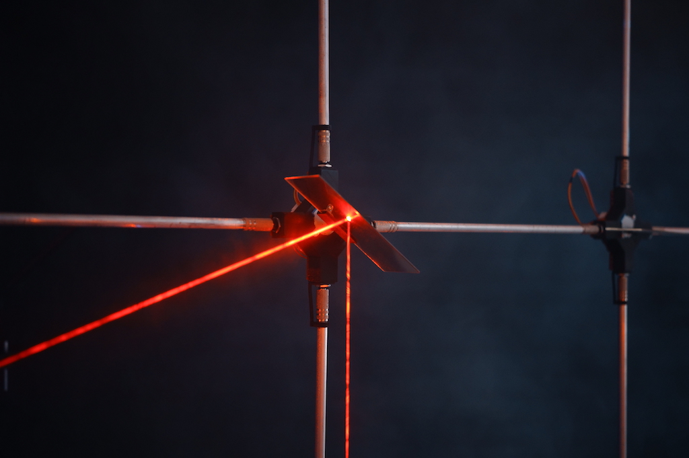
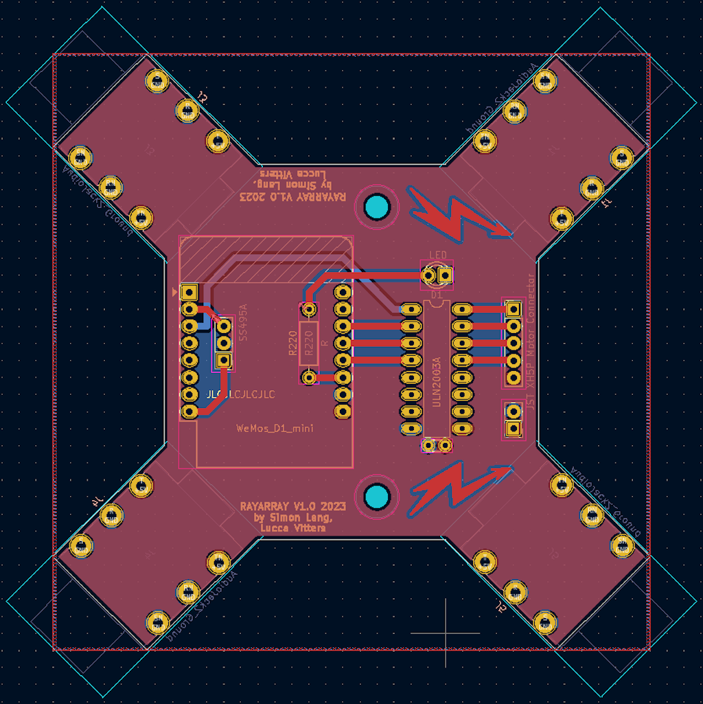
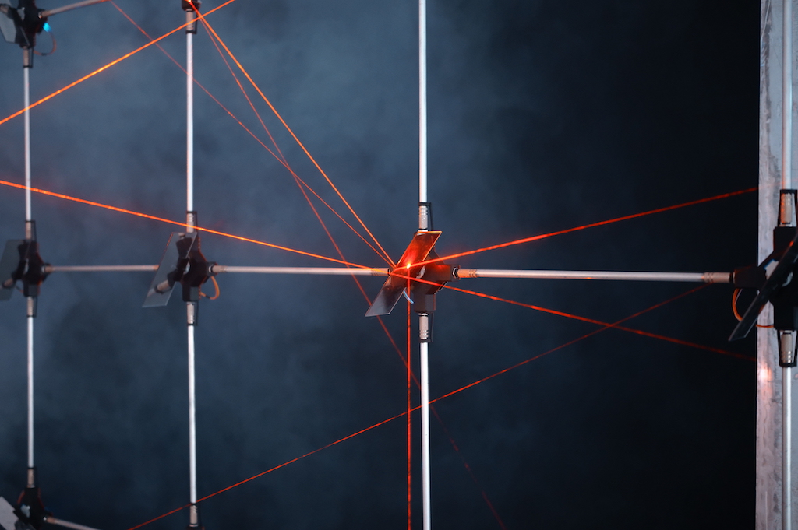
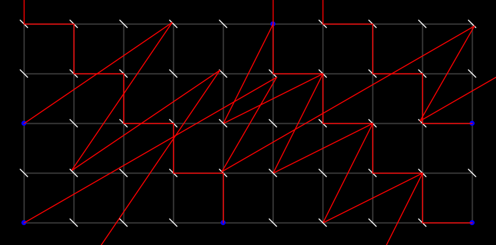
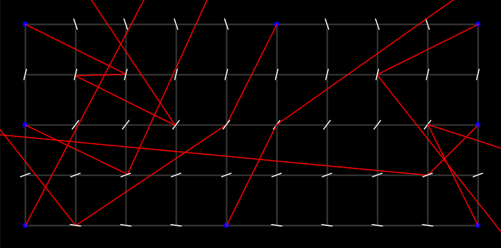
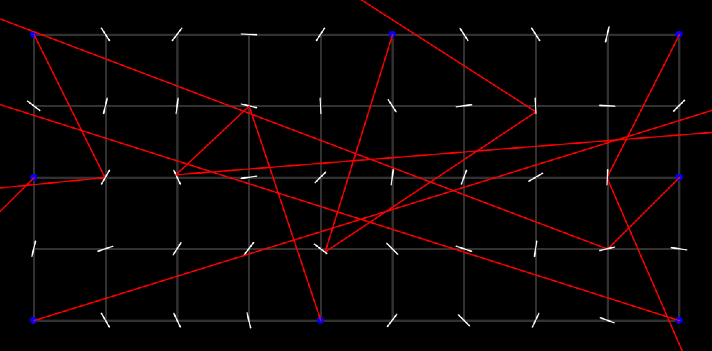

# RAYARRAY  

## a pattern beyond control

*RAYARRAY* is a kinetic light installation consisting of an array of rays that move accross a network of nodes.

  

build: [Simon Lang](https://simonslang.de)
 
code: [Lucca Vitters](https://luccavitters.art)

 

photos: [Hsun Hsiang Hsu](https://www.hsunhsianghsu.com/)

 

## ARRAY

The array of nodes are connected in a fully customizable grid. The grid is connected by 35mm aluminium tubes that act as jumpers to carry 5V of power, which are connecting the nodes via a 1/4'' jack on each of the four sides.

 

## NODE

Nodes are 3D printed brackets that contain a custom PCB with a ESP-8266 microcontroller and a motor controller and carry either a rotatable mirror on a stepper motor or a laser diode.

 

## RAY

The laser diodes' rays are reflected in controlled or uncontrolled patterns from both sides of the attached mirrors.

 
 
 

# SIMULATION

A central Processing sketch that simulates the installation's components controls the mirrors' rotations. The simulation applies a range of generative choreographies, resulting in either uniform or entirely chaotic patterns. The rotation values for the individual stepper motors are then send over WIFI to the microcontrollers. The simulation can save and load custom grid dimensions and positions of the mirrors and laser diodes, so that different setups of the installation can be controlled.

 
 

## RAYARRAY_processing

Start *'RAYARRAY_processing.pde'* to start the *RAYARRAY* simulation Processing sketch. Pressing on the nodes with the left mouse button will cycle them from being a mirror, a laser or an empty node. Dragging with the right mouse button will rotate the lasers or mirrors. 
  
On startup, *RAYARRAY_processing* will look for ESP8266 microcontrollers broadcasting their IP on the same network as *RAYARRAY_processing*. 
  
Hovering over the nodes and pressing the 'I' key will let you input an ID, which should correspond to the ID of the node at the same position inside the physical *RAYARRAY* grid. 
  
If the IDs from the nodes' broadcasts and the IDs that have been assigned in *RAYARRAY_processing* are them same, the ID numbers in the Processing sketch will go from red to green.
  

**SHOW IDS** will switch between the node's ID numbers being displayed or not.
  
**SAVE CONFIG** will save the current config (dimensions of grid; are the nodes mirrors, lasers, or empty) into a JSON file with the same name as the grid dimensions. *RAYARRAY_processing* will also attempt to load this config from a JSON file with the same dimensions as the Processing sketch currently has on startup. The same applies to the **LOAD CONFIG** button. 
  
**GO HOME** will send an OSC message to all connected nodes that tells them to move to their home positions. 
  
**RESTART NODES** will send an OSC message to all connected nodes that restarts the ESP8266 entirely. 
  
**GET STEPS** will send an OSC message to all connected nodes that asks for the motor's current step, the answer will be displayed in the console. 
  
**ROTATE MIRRORS** will start the rotation of the mirrors according to the current rotation mode, which can be changed in the **MIRROR ROTATION MODE** dropdown. 
  
**MIRROR SPEED** controls the rotation speed. 
  
**SEND ROTATION** will send the node's orientation to the corresponding ESP8266 as stepper motor steps via OSC messages in the same network. 
  
**SEND FREQ** is the frequency with which the nodes are updated with motor positions in milliseconds. 
  
**AUTO MODE** will change the **MIRROR ROTATION MODE** after intervals that can be set by **AUTO INTERVAL**, which is in minutes. 
  
**AUTO LASER** will aim the lasers to one of the mirrors around them at the same time as the **MIRROR ROTATION MODE** changes in 'AUTO MODE'. 
  
**ARM HALT** will arm the entire progam to halt for a duration set in **HALT DURATION** so that the nodes will stop rotating. This will happen after intervals set in **HALT INTERVAL**. 
  
**MIRROR ROTATION MODE** changes the rotation mode of the mirrors. The modes will apply universal 'choreographed' or individual rotations to the mirrors. 
  

The dimensions of the *RAYARRAY_processing* can be changed before startup with the 'gridX' and 'gridY' variables. *RAYARRAY_processing* will look for a JSON config file of the same dimensions at startup. 
  
The pysical dimensions of and between the node's mirrors can be changed by the variables 'absoluteConnectionLength' (length from the center of one node to the next in cm) and 'absoluteMirrorWidth' (width of the attached mirrors in cm). 
  
The variable 'scaleFromCentimetersToPixels' changes how large the simulation is displayed on the screen.  
  

## RAYARRAY_arduino

*RAYARRAY_arduino* contains the files to be uploaded to the ESP8266 microcontrollers that control the *RAYARRAY* installation. They broadcast their IDs and IPs over an assigned network so that the *RAYARRAY* simulation can assign them to their physical positions inside the *RAYARRAY* grid. 
  
On startup, they perform a homing sequence using a hall sensor attached to the node, so that the mirrors (or lasers) will receive a home position. After that, they are ready to receive absolute stepper motor positions or other control commands via OSC messages. 
  

## firmware_server

'firmware_server.js' is a node.js program that will enable the ESP8266 nodes to fetch a new firmware from a server, if the firmware version number exceeds the version number of their current firmware.
  

'moveFirmware.command' will move and rename the output of the Arduino IDE's "export compiled binary" function so that it can be used by 'firmware_server.js'. It will also open the file 'version.txt' so that the firmware version number can be updated. 
  
After that, 'startNode.command' will start the 'firmware_server.js' node program. Both commands are written for macOS and use absolute paths, so they have to be changed if used on another machine.
  

## setNodeID_arduino

'setNodeID_arduino.ino' is an Arduino program that will write an ID number to the ESP8266's EEPROM onboard storage. 
  
This will enable the *RAYARRAY_processing* to differentiate between the otherwise identical nodes.
  